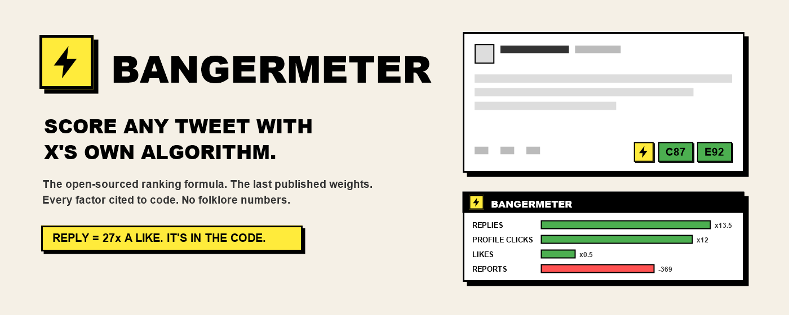
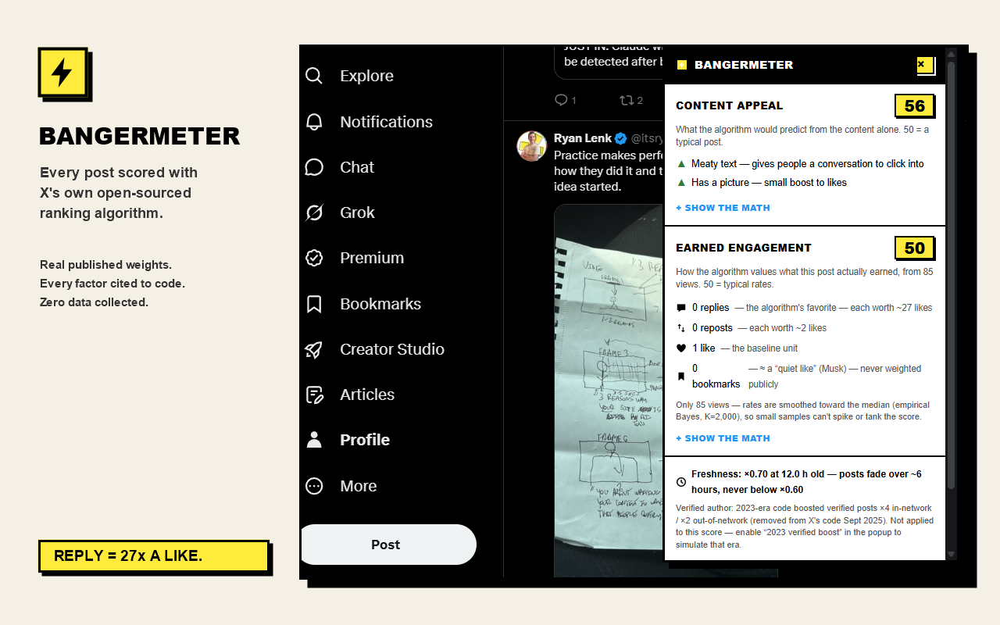

# Bangermeter ⚡

**Score any post with X's own published ranking weights.**

A Chrome extension that scores posts on x.com using the real For You weights and the real
scorer arithmetic from [xai-org/x-algorithm](https://github.com/xai-org/x-algorithm) —
`home-mixer/params/param.rs` for the values, `home-mixer/scorers/ranking_scorer.rs` for the
math. Full source-traced findings: [RESEARCH.md](RESEARCH.md).

> **August 13, 2026.** X published the production weights for the For You timeline. Until
> that morning the only weights anyone had were a March/April 2023 snapshot, and about a
> third of the ranking heads had never been given a number at all. Bangermeter v0.9.0
> replaced the entire weight layer with the published set. Everything below describes the
> new one.

## Install

1. Open `chrome://extensions`
2. Enable **Developer mode** (top right)
3. Click **Load unpacked** → select the `extension/` folder
4. Browse x.com — every timeline post gets a ⚡ badge; click it for the full breakdown.
   The compose box gets a live draft meter as you type.

## What it looks like

Every post gets a badge. Click it for the breakdown: which signals fired, what each
reply and repost is worth, the rescoring factors that applied, and a "Show the math"
expander with the full weight × probability table.

## What the scores mean

Every post gets up to two 0–100 scores (50 = median baseline post):

- **C — Content score (prospective).** What the ranker would be predisposed to predict from
  the *content* alone: baseline action probabilities per head, adjusted by detected content
  signals (question, thread, video, bare link, hashtag piles, engagement bait), run through
  the published weights and the real scorer arithmetic.
- **E — Engagement score (retrospective).** Applies the published weights to the post's
  *actual* rates (likes/reposts/replies ÷ views). Requires a visible view count.

Click the badge for the breakdown: per-head contributions (`weight × P`), detected signals
with direction and provenance, rescoring factors, freshness, and a collapsible table of
what the published weights actually say.

## Creator tools (v0.10.0)

- **Reply mode.** Reply drafts are scored as replies — the ×0.75 in-network reply factor
  the compose meter previously missed — and the breakdown panel gets a reply-scoring
  section: out-of-network replies never reach For You at all (`OONRetweetReplyFilter`),
  replies are ineligible for the +15.0 mutual-follow boost, and replies to accounts over
  100K followers are scored 0–3 by a Grok model whose rubric X withholds (the published
  *inputs* are listed; no invented direction — and no duration for the score-0 label,
  because none is published). Where a reply sorts inside a thread is disclosed as
  unpublished rather than guessed.
- **Score history (opt-in).** Off by default; enable it in the popup and opening a
  breakdown panel logs the scores to a local, capped list (`chrome.storage.local`,
  200 entries — id, time, scores, an 80-char snippet). The popup shows the recent log
  with links back to each post, plus a Clear button. Nothing ever leaves the browser.
- **Draft comparison.** The compose meter gains a `+ compare` button: save up to three
  variants of a draft (A/B/C), rewrite, and pick the best-scoring one. Variants live in
  memory only and vanish with the page.
- **Posting-cadence warning.** When an author has more than one post in the loaded stretch
  of feed, the panel reports the author-diversity attenuation production would apply —
  `(1 − 0.25) × 0.5^k + 0.25`: an author's 2nd post in the slate runs ×0.625, the 3rd
  ×0.44, to a ×0.25 floor — wherever in the slate they sit. Reported as context, not
  applied to the score (it is slate-relative and viewer-specific).
- **Under the Hood import.** Pilot-cohort users can import the JSON report X lets them
  download from `x.com/i/under_the_hood`; the popup summarizes the visibility labels X
  itself applied (monthly aggregates — the report carries no post IDs). Parsed locally,
  stored locally, validated against the published label allowlist.

## Methodology and honesty

- **Formula:** `Σ(weight × P(action))` over the Phoenix head set, then `offset_score` —
  positive posts get `+0.001`, and any post whose weighted sum goes **net-negative** is
  rescaled into `[0, 0.000894)`, which drops it below every positive-scoring post no matter
  what else it earned. Then the post-hoc factors: author diversity
  `(1 − floor) × decay^k + floor`, and the ×0.75 out-of-network factor. This is a direct
  port of `ranking_scorer.rs`, not an approximation of it.
- **Weights:** the published production set. Likes 0.5 · replies 5.0 (**20.0** on an
  original post from a mutual follow) · reposts 1.0 · quotes 5.0 · shares 2.0 · DM shares
  5.0 · **copy-link shares 20.0** · follow-author 4.0 · post clicks 0.4 · link opens 0.2 ·
  photo expand / video open / video-quality-view / quoted click 0.05 · dwell time 0.004 per
  second · not-dwelled −0.02 · not-interested −43.2 · block −31.2 · mute −58.8 · report
  −234.0. Profile clicks, binary dwell and quoted-vqv ship at **0.0** — X zeroed them, and
  the tool shows that rather than hiding it.
- **Weights multiply predicted probabilities, not counts.** A report does not cost 234
  points; −234 is the coefficient on *how likely a viewer is to report the post*. On Aug 14
  2026 X made this explicit in the code: reading the ratios as count equivalences — their
  example is *"one report cancels 468 likes"* — is **"incorrect."** They also gave the
  reason the negatives are so large: a Report's baseline probability is **over 1000× lower
  than a Like's**, so it needs a bigger coefficient to affect ranking at all.
- **Engagement only counts from the Home Timeline.** Opening a link someone sent you has no
  ranking impact, so passing your own post round a group chat does nothing for reach. The
  copy-link coefficient pays for a viewer copying it *in-feed*, not for the visits after.
- **Brigading is structurally weak.** Predictions are per-viewer and personalized, so mass
  block/report campaigns mostly shift what gets recommended to users similar to the
  brigaders rather than burying the post for everyone.
- **Hard filters sit outside scoring.** `Brazil2026ElectionFilter` removes 665 accounts
  reported to Brazil's Electoral Court from For You unless you follow them. It runs before
  ranking, so no weight offsets it — a reminder that the weighted sum is not the whole
  system.
- **The honest boundary.** The weights are X's. The probabilities are ours. X predicts them
  with Phoenix, a transformer we don't have; Bangermeter derives three of them from real
  counts (likes, replies, reposts) and estimates the rest from content signals. Every
  number in the UI is tagged with which layer it came from, and the popup labels every head
  as `from counts`, `estimated`, `zeroed by X` or `viewer-specific`.
- **Gates we can see and gates we can't.** Video-quality-view needs duration strictly over
  10s, so GIFs and short clips are excluded — the extension reads the duration overlay
  where X renders one. A second vqv gate (the *viewer* having under 10,000 followers) is
  viewer state a page script cannot read; it is disclosed, not modeled.
- **No folklore numbers.** "Bookmark 20×", "links −30–50%", "3+ hashtags −40%", "block
  −120 / mute −100" all failed source-tracing before the release — and none of them matched
  the real values when those arrived. Bookmarks turn out to have **no head at all**.
- **Two archival factors, opt-in or sourced.** The 2023-era **×4 / ×2** verified-author
  multiplier (archived commit `ec83d01dca`; absent from the 2026 release) is behind a
  default-off toggle. Posts with a displayed **Community Note** get ×0.5 on the prospective
  score — that 0.5 is our round figure inside a ×0.39–0.75 range from three causal studies,
  and is labeled as our pick, not X's.
- **Relative score, not predicted reach.** X says it syncs these defaults from production
  by cron, which makes them current rather than historical — but the score is still a
  relative read against a typical post, not an impression forecast.

## Known limitations

- Count parsing prefers a locale word table (16 locales today; more join only with sourced
  strings) and falls back to the locale-independent `data-testid` buttons, so counts and
  views survive even on locales the table does not know.
- Reply detection uses whichever signal the surface actually provides: the "Replying to"
  label on timelines, and **position in the thread** inside a conversation or on
  `with_replies`, where X renders no label at all.
- Engagement-bait detection covers English, Hinglish and Devanagari imperative calls to
  action. The Devanagari patterns are **not** transliterations of the Hinglish ones —
  Hindi puts the call to action last, so "like karo agar X" is an English calque that
  barely occurs, and the real form is "…तो लाइक करें" or "कमेंट बॉक्स में जरूर". That
  anchor does the work: on X the bare verb phrase is usually an argument ("पहले पढ़ो,
  फिर कमेंट करो" — *first read it, then comment*) rather than a request for engagement,
  so bare `कमेंट कर` / `फॉलो कर` are deliberately excluded. Validated against real Hindi
  posts collected from X: zero false positives, conservative recall.
- The rhetorical-question genre ("Kya …?", "X ya Y?") is deliberately not detected.
  Tested against 228 real posts, the structural rule for it flagged exactly one — a
  top-quartile post — and missed the actual bait. ALL-CAPS detection is Latin-only by
  nature, since caseless scripts have no capitals to count. Reply detection on timeline posts still needs the
  localized "Replying to" marker; reply *drafts* are detected structurally (dialog order,
  status-page URL), which is locale-independent.
- The E score needs a visible view count (hidden on some surfaces).
- Viewer-specific factors can't be observed: in-network status, mutual-follow status and
  the vqv follower gate. Out-of-network and mutual-follow are popup toggles instead.
- Quote counts aren't exposed in the timeline DOM, so the quote head (5.0) is estimated
  rather than measured.
- X changes its DOM without notice; selectors have documented fallbacks.

## Project files

| File | Purpose |
|---|---|
| `extension/` | The Chrome extension (MV3, vanilla JS, no build step) |
| `extension/weights.js` | Single source of truth: weight layer + estimator layer, all provenance-tagged |
| `extension/scoring.js` | Pure scoring engine (direct port of `ranking_scorer.rs`) |
| `extension/content.js` | Badges, breakdown panel, compose meter |
| `extension/test.html` | Engine self-test — open in any browser (228 assertions) |
| `extension/fixture.html` | X-DOM fixture harness for the content script |
| `extension/fixture-thread.html` | Reply-detection harness — asserts the conversation, `with_replies` and home-timeline surfaces separately, because X marks a reply differently on each. Needs `serve-fixtures.js` (it reads `location.pathname`) |
| `extension/serve-fixtures.js` | Tiny static server for the harnesses, including the x.com-shaped paths the reply-detection cases need |
| `extension/fixture-compose.html` | Compose-meter visibility harness — asserts the draft meter survives X's scrolling, overflow-hidden compose dialog (it prints its own pass count) |
| `extension/bangermeter.user.js` | Single-file Tampermonkey build (generated — see `store-assets/make-userscript.ps1`) |
| `skills/audience-readout/` | Claude skill: collect one account's real posts, score them, and write a read-out. Carries the analytical rules (rates not counts, confound checks) and the privacy rule — never commit an archive. Copy to `~/.claude/skills/` to install — see its SKILL.md |
| `store-assets/weights-export.js` | Emits the weight values the store art needs, straight from `weights.js` |
| `store-assets/make-*.ps1` | Generators for the userscript, the upload package, and the promo art |

Nothing numeric is typed into the store art. `make-promos.ps1` and `make-screenshot.ps1`
read their weights and ratios from `extension/weights.js` through `weights-export.js`, so a
tile cannot keep publishing a value after the code has moved on — which is exactly what
happened when those numbers were hardcoded.

## Verification status

- Engine math: **228/228 self-tests pass** (`test.html`). Every one of the 26 published
  weights and its feature-switch parameter name is asserted against `param.rs`
  individually, so a silent transcription error fails the suite rather than shipping.
  All 26 re-verified unchanged against the live repo on Aug 25, 2026.
- Locale strings (reply markers and count words for 16 locales) are transcribed from X's
  own production i18n bundles (`abs.twimg.com/responsive-web/client-web/i18n/*`), fetched
  Aug 25, 2026 and cross-checked against Wayback captures of the same bundles. Locales
  join the table only with a sourced string — the same rule the weight layer follows.
- Adversarially reviewed at v0.9.0 by three independent passes — weight transcription,
  Rust-to-JS arithmetic fidelity, and a stale-claim sweep. The arithmetic pass swept
  ~654k generated inputs for NaN, out-of-range and non-monotonic scores and found none,
  and used mutation testing to prove which assertions were load-bearing. Findings from
  all three are fixed in this release; the notable ones are recorded in
  [RESEARCH.md](RESEARCH.md).
- Content script (badges, panel, meter, virtualized lists, quote-tweet scoping): exercised
  against the DOM fixture (`fixture.html`). The fixture is an eyeball harness — it renders
  and must not throw; it carries no assertions.
- Live x.com: verified in a logged-in session, Aug 2026. Badge, panel and per-head copy
  render correctly against the live DOM, and a spot-checked post matched the engine's
  arithmetic to the rounded point. Live use is also what surfaced the two compose-meter
  defects the fixture had not modeled. Selectors target `article[data-testid="tweet"]`,
  the action-bar `role="group"` aria-label, and `tweetTextarea_*`, each with fallbacks.

## Credits

- **Hindi and Hinglish guidance** — [Shivangi Bhattacharjee](https://www.linkedin.com/in/shivangi-bhattacharjee/),
  who worked through the bait phrasing with us. The useful finding was structural rather
  than lexical: Hindi puts the call to action at the *end* of the sentence, so the
  Hinglish "like karo agar…" order is an English calque and a Devanagari pattern built by
  transliterating it would never have matched anything. Every Hindi pattern the extension
  ships anchors on `तो` / `जरूर` instead, and the bare verb is deliberately left alone
  because on X it usually belongs to an argument rather than a request for engagement.
